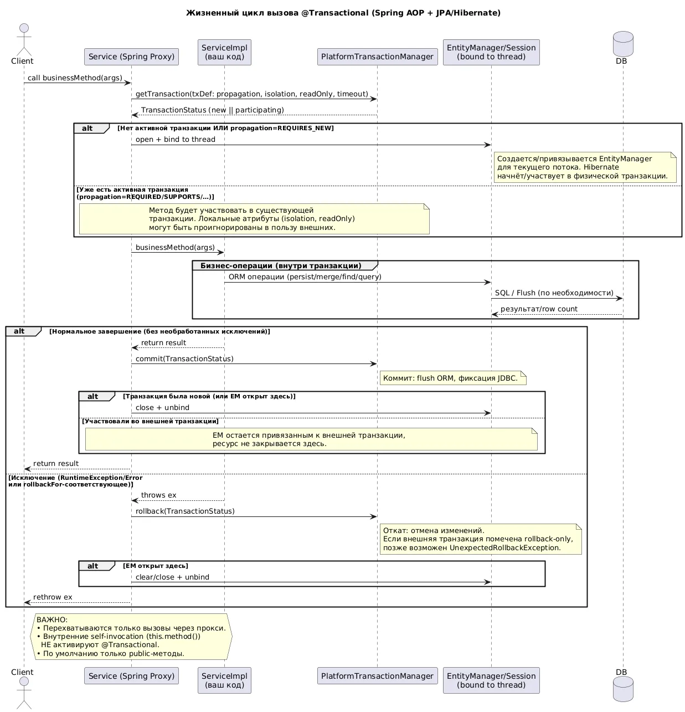

# Основы работы `@Transactional`: механизмы Spring
#transactional #spring
> **Источник**: [proselyte.net/transactional-annotation/](https://proselyte.net/transactional-annotation/)  
---

## 📌 Определение

`**@Transactional**` — это аннотация в Spring, которая упрощает управление транзакциями в приложениях. Она позволяет declaratively (декларативно) определять границы транзакций, избавляя разработчика от ручного управления транзакциями через `PlatformTransactionManager`.

---

## 🔧 Механизмы работы `@Transactional`

### 1. **Декларативное управление транзакциями**

- **Описание**: Транзакции управляются через аннотации, а не программно.
- **Преимущества**:
  - Уменьшает количество шаблонного кода.
  - Централизует логику управления транзакциями.
  - Упрощает тестирование и поддержку кода.
- **Пример**:
  ```java
  @Service
  public class UserService {
      @Transactional
      public void updateUserEmail(Long userId, String newEmail) {
          // Логика обновления email пользователя
      }
  }
  ```

---

### 2. **Атрибуты аннотации `@Transactional**`


| Атрибут                                  | Описание                                                                                   | Значение по умолчанию                               | Пример                                                                  |
| ---------------------------------------- | ------------------------------------------------------------------------------------------ | --------------------------------------------------- | ----------------------------------------------------------------------- |
| `**value**` или `**transactionManager**` | Имя `PlatformTransactionManager`, который будет использоваться для управления транзакцией. | `""` (используется дефолтный `TransactionManager`). | `@Transactional("customTransactionManager")`                            |
| `**propagation**`                        | Определяет поведение транзакции при вызове метода из другой транзакции.                    | `REQUIRED`                                          | `@Transactional(propagation = Propagation.REQUIRES_NEW)`                |
| `**isolation**`                          | Уровень изоляции транзакции.                                                               | `DEFAULT` (уровень изоляции по умолчанию для СУБД). | `@Transactional(isolation = Isolation.READ_COMMITTED)`                  |
| `**timeout**`                            | Таймаут для транзакции (в секундах).                                                       | `-1` (нет таймаута).                                | `@Transactional(timeout = 30)`                                          |
| `**readOnly**`                           | Указывает, что транзакция только для чтения.                                               | `false`                                             | `@Transactional(readOnly = true)`                                       |
| `**rollbackFor**`                        | Исключения, при которых транзакция будет откатываться.                                     | `{}` (откат при `unchecked` исключениях).           | `@Transactional(rollbackFor = {IOException.class, SQLException.class})` |
| `**noRollbackFor**`                      | Исключения, при которых транзакция **не** будет откатываться.                              | `{}`                                                | `@Transactional(noRollbackFor = {CustomException.class})`               |


---

## 🔄 Propagation (Распространение транзакций)

**Propagation** определяет, как ведёт себя транзакция при вызове метода из другой транзакции. Основные типы:


| Тип                 | Описание                                                                               | Пример                                                    |
| ------------------- | -------------------------------------------------------------------------------------- | --------------------------------------------------------- |
| `**REQUIRED**`      | Если есть текущая транзакция, используется она. Если нет — создаётся новая.            | `@Transactional(propagation = Propagation.REQUIRED)`      |
| `**REQUIRES_NEW**`  | Всегда создаёт новую транзакцию. Если есть текущая, она приостанавливается.            | `@Transactional(propagation = Propagation.REQUIRES_NEW)`  |
| `**SUPPORTS**`      | Если есть текущая транзакция, используется она. Если нет — выполняется без транзакции. | `@Transactional(propagation = Propagation.SUPPORTS)`      |
| `**NOT_SUPPORTED**` | Выполняется без транзакции. Если есть текущая, она приостанавливается.                 | `@Transactional(propagation = Propagation.NOT_SUPPORTED)` |
| `**MANDATORY**`     | Требует наличия текущей транзакции. Если её нет — выбрасывает исключение.              | `@Transactional(propagation = Propagation.MANDATORY)`     |
| `**NEVER**`         | Выполняется без транзакции. Если есть текущая — выбрасывает исключение.                | `@Transactional(propagation = Propagation.NEVER)`         |
| `**NESTED**`        | Если есть текущая транзакция, создаётся вложенная. Иначе — как `REQUIRED`.             | `@Transactional(propagation = Propagation.NESTED)`        |


---

## 🔄 Поведение `rollback` (Откат транзакций)

- **По умолчанию**: Транзакция откатывается при **unchecked исключениях** (наследники `RuntimeException` и `Error`).
- **Настройка**:
  - `rollbackFor`: Указывает, при каких исключениях откатывать транзакцию.
  - `noRollbackFor`: Указывает, при каких исключениях **не** откатывать транзакцию.

**Пример**:

```java
@Transactional(rollbackFor = {IOException.class, SQLException.class})
public void processFile() throws IOException {
    // Логика обработки файла
}
```

---

## 💡 Как работает `@Transactional` под капотом

1. **AOP (Aspect-Oriented Programming)**:
  - Spring использует **прокси** (AOP) для применения транзакционной логики.
  - При вызове метода с `@Transactional` создаётся прокси-объект, который управляет транзакцией.
2. **Проксирование**:
  - Для классов: используется **JDK Dynamic Proxy** (если класс реализует интерфейс).
  - Для классов без интерфейсов: используется **CGLIB Proxy** (создаёт подкласс).
3. **Жизненный цикл транзакции**:
  - **Начало**: Перед выполнением метода.
  - **Коммит**: После успешного выполнения метода.
  - **Откат**: При выбрасывании исключения (если оно входит в `rollbackFor`).

---

## ⚠️ Важные нюансы

1. **Self-invocation (Самовозов)**:
  - Если метод с `@Transactional` вызывается из другого метода **того же класса**, транзакция **не сработает** (из-за особенностей проксирования).
  - **Решение**: Использовать `AopContext.currentProxy()` или вынести вызов в другой класс.
2. **Приватные методы**:
  - `@Transactional` **не работает** на приватных методах (прокси не может перехватить вызов).
  - **Решение**: Использовать `public` методы.
3. **Исключения**:
  - По умолчанию откат происходит только для **unchecked исключений** (`RuntimeException` и `Error`).
  - Для **checked исключений** нужно явно указывать `rollbackFor`.
4. **Производительность**:
  - Чрезмерное использование `@Transactional` может привести к избыточным блокировкам и снижению производительности.
  - Рекомендуется использовать транзакции только там, где это необходимо.

---



## 📌 Рекомендации для интервью

1. **Знайте атрибуты** `@Transactional`:
  - `propagation`, `isolation`, `timeout`, `readOnly`, `rollbackFor`, `noRollbackFor`.
2. **Понимайте `Propagation**`:
  - Объясните разницу между `REQUIRED`, `REQUIRES_NEW` и `NESTED`.
  - Приведите примеры, когда какой тип использовать.
3. **Проксирование**:
  - Объясните, почему `@Transactional` не работает на приватных методах.
  - Расскажите про **self-invocation problem** и как его решить.
4. **Практика**:
  - Напишите пример кода с настройкой `rollbackFor` для кастомного исключения.
  - Объясните, почему иногда нужно использовать `REQUIRES_NEW` вместо `REQUIRED`.

---

## 🔗 Полезные ссылки

- [Оригинальная статья на Proselyte](https://proselyte.net/transactional-annotation/)
- [Spring Transaction Management Documentation](https://docs.spring.io/spring-framework/docs/current/reference/html/data-access.html#transaction)
- [Spring AOP Documentation](https://docs.spring.io/spring-framework/docs/current/reference/html/core.html#aop)
