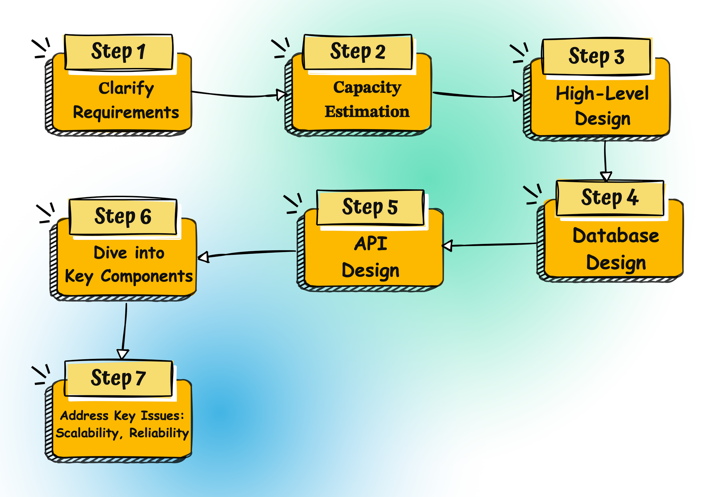
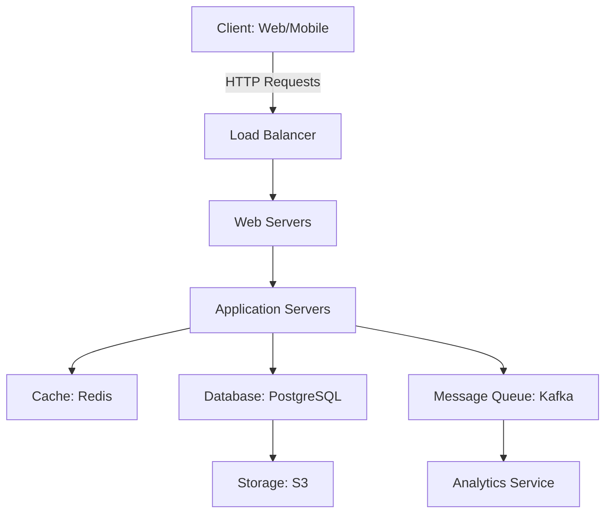
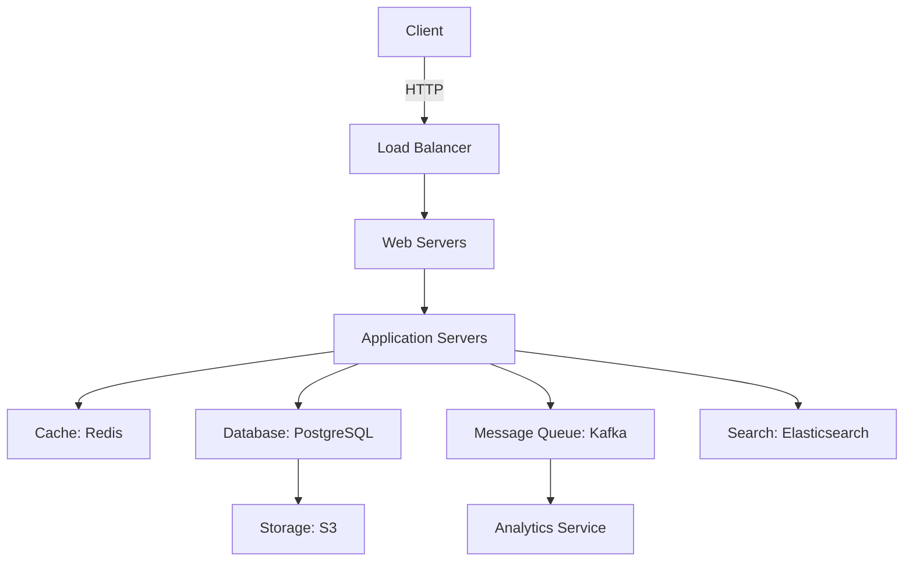

# Как отвечать на вопросы по System Design на интервью

> **Источник**: [blog.algomaster.io – How to Answer a System Design Interview Problem](https://blog.algomaster.io/p/how-to-answer-a-system-design-interview-problem)  
> **Цель**: Структурированный подход к решению задач по проектированию систем на интервью.

---

## 📌 Введение

Проектирование систем (**System Design**) — это один из самых сложных этапов технического интервью, особенно для позиций **Senior/Middle+**. В отличие от алгоритмических задач, здесь нет одного правильного ответа. Важно **продемонстрировать структурированное мышление**, умение анализировать требования и принимать обоснованные решения.

Этот гайд поможет вам **систематизировать подход** к решению задач по System Design.

---




## 🎯 7 Шагов для успешного ответа

---

### **Шаг 1: Уточнение требований (Clarify Requirements)**

**Цель**: Полностью понять задачу и избежать неверного направления проектирования.

#### 🔹 Типы требований

1. **Функциональные требования (Functional Requirements)**
  - Какие **основные функции** должна поддерживать система?
  - Какие функции **наиболее критичны**?
  - Кто будет пользоваться системой (клиенты, внутренние команды)?
  - Какие **действия** должны быть доступны пользователям?
  - Как пользователи будут взаимодействовать с системой (веб, мобильное приложение, API)?
  - Нужно ли поддерживать **многоязычность**?
  - Какие **типы данных** должна обрабатывать система (текст, изображения, видео)?
  - Нужно ли интегрироваться с **внешними сервисами** (платежные системы, соцсети)?
2. **Нефункциональные требования (Non-Functional Requirements)**
  - Каков **масштаб** системы (количество пользователей, запросов в секунду)?
  - Какой **объём данных** ожидается?
  - Какие **входные и выходные данные** у системы?
  - Каково **соотношение чтения/записи** (read-to-write ratio)?
  - Допустимы ли **простои** или система должна быть **высокодоступной**?
  - Какие **требования к задержке** (latency)?
  - Насколько критична **консистентность данных**? Допустима ли **eventual consistency**?
  - Какие **приоритеты**: производительность, масштабируемость, надёжность?

#### 💡 Советы

- **Задавайте вопросы** интервьюеру, чтобы уточнить детали.
- **Фиксируйте** все уточнённые требования (можно на доске или в блокноте).
- **Пример**: Если проектируете Twitter, уточните:
  - Сколько пользователей?
  - Сколько твитов в секунду?
  - Нужна ли поддержка медиафайлов?
  - Какие требования к доступности?

---

### **Шаг 2: Оценка мощностей (Capacity Estimation)**

**Цель**: Оценить **масштаб системы** и определить требования к ресурсам.

#### 🔹 Что оценивать?

1. **Пользователи**
  - Сколько **ежедневных активных пользователей** (DAU)?
  - Сколько **одновременных пользователей** в пиковые часы?
  - Ожидается ли **рост** пользовательской базы?
2. **Трафик**
  - Сколько **запросов в секунду** (RPS — Requests Per Second)?
  - Каково **соотношение чтения/записи**?
  - Есть ли **пиковые нагрузки** (например, в Чёрную пятницу)?
3. **Хранилище**
  - Сколько **данных** нужно хранить?
  - Какие **типы данных** (структурированные, неструктурированные, мультимедиа)?
  - Какой **темп роста** данных?
4. **Память**
  - Сколько **кэша** потребуется для часто запрашиваемых данных?
  - Какие данные стоит **кэшировать**?
5. **Сеть**
  - Какая **полоса пропускания** потребуется?
  - Каков **средний размер запроса/ответа**?

#### 📊 Пример расчёта для Twitter

- **Пользователи**: 100 млн DAU, 10 млн одновременно в пик.
- **Твиты**: 100 тыс. твитов/сек (пик — 200 тыс./сек).
- **Чтение**: 1 млн запросов/сек (соотношение чтения/записи = 10:1).
- **Хранилище**:
  - 1 твит ≈ 1 КБ (текст + метаданные).
  - 100 тыс. твитов/сек × 86400 сек/день ≈ **8.64 ТБ/день** новых данных.
- **Кэш**: Кэшировать последние 10% твитов (горячие данные).

#### 💡 Советы

- Используйте **округлённые числа** (например, 100 тыс. вместо 98,765).
- Учитывайте **рост** системы на 1–2 года вперёд.
- Если интервьюер не требует детальных расчётов, сделайте **прикидку** (order of magnitude).

---

### **Шаг 3: Проектирование высокоуровневой архитектуры (High-Level Design)**

**Цель**: Спроектировать **основные компоненты системы** и их взаимодействие.

#### 🔹 Основные компоненты


| Компонент                   | Описание                                        | Пример технологий                           |
| --------------------------- | ----------------------------------------------- | ------------------------------------------- |
| **Клиентские приложения**   | Как пользователи взаимодействуют с системой.    | Веб-браузер, мобильное приложение, CLI.     |
| **Вэб-серверы**             | Обрабатывают входящие запросы от клиентов.      | Nginx, Apache, Spring Boot.                 |
| **Балансировщики нагрузки** | Распределяют трафик между серверами.            | AWS ALB, Nginx, HAProxy.                    |
| **Серверы приложений**      | Бизнес-логика системы.                          | Java/Spring, Node.js, Python/Django.        |
| **Базы данных**             | Хранение данных.                                | PostgreSQL, MySQL, MongoDB, Cassandra.      |
| **Кэш**                     | Ускорение доступа к часто запрашиваемым данным. | Redis, Memcached.                           |
| **Очереди сообщений**       | Асинхронная обработка задач.                    | Kafka, RabbitMQ, AWS SQS.                   |
| **Внешние сервисы**         | Интеграция с сторонними API.                    | Stripe (платежи), AWS S3 (хранение файлов). |


#### 📐 Как рисовать диаграмму?

1. **Сохраняйте простоту**: не перегружайте диаграмму деталями.
2. **Используйте стандартные обозначения**:
  - Прямоугольники — компоненты.
  - Стрелки — потоки данных.
3. **Показывайте взаимодействие**: как данные перемещаются между компонентами.
4. **Обосновывайте выбор технологий**:
  - Почему **PostgreSQL**, а не MongoDB? (Нужна ACID-консистентность.)
  - Почему **Redis** для кэша? (Низкая задержка, высокая производительность.)

#### 📌 Пример: Архитектура Twitter



---

### **Шаг 4: Проектирование базы данных (Database Design)**

**Цель**: Спроектировать **модель данных**, выбрать подходящее хранилище и оптимизировать запросы.

#### 🔹 Моделирование данных

1. **Определите сущности**:
  - Пользователи, посты, комментарии, лайки (для соцсети).
  - Заказы, товары, корзина (для e-commerce).
2. **Определите связи между сущностями**:
  - One-to-Many (пользователь → твиты).
  - Many-to-Many (пользователь ↔ лайки).
3. **Определите атрибуты**:
  - Для пользователя: `id`, `name`, `email`, `password_hash`.
  - Для твита: `id`, `user_id`, `text`, `timestamp`.
4. **Первичные ключи**: Уникальные идентификаторы для каждой сущности.
5. **Нормализация**: Уменьшение избыточности данных (3NF, BCNF).

#### 🗃 Выбор хранилища


| Тип БД                | Когда использовать                                                          | Примеры            | Плюсы                                         | Минусы                             |
| --------------------- | --------------------------------------------------------------------------- | ------------------ | --------------------------------------------- | ---------------------------------- |
| **Реляционные (SQL)** | Структурированные данные, сложные связи, ACID-транзакции.                   | PostgreSQL, MySQL  | Консистентность, поддержка JOIN.              | Масштабируемость по чтению/записи. |
| **NoSQL**             | Неструктурированные данные, высокая масштабируемость, eventual consistency. | MongoDB, Cassandra | Горизонтальное масштабирование, гибкая схема. | Нет JOIN, eventual consistency.    |
| **Ключ-значение**     | Кэширование, сессии, простые данные.                                        | Redis, DynamoDB    | Низкая задержка, высокая производительность.  | Ограниченные возможности запросов. |
| **Графовые**          | Сложные связи между данными (соцсети, рекомендации).                        | Neo4j              | Эффективные запросы по связям.                | Сложность в масштабировании.       |


#### 🔧 Проектирование схемы

- **Таблицы**: Определите таблицы и их столбцы.
- **Индексы**: Создайте индексы для часто запрашиваемых полей.
- **Денормализация**: Дублируйте данные для ускорения чтения (если нужно).
- **Партиционирование**: Разделите таблицы по диапазонам (например, по дате).
- **Шардирование**: Разделите данные по нескольким БД (если нужно масштабироваться).

#### 📊 Пример: Схема для Twitter

```sql
-- Пользователи
CREATE TABLE users (
    id BIGSERIAL PRIMARY KEY,
    username VARCHAR(50) UNIQUE NOT NULL,
    email VARCHAR(100) UNIQUE NOT NULL,
    password_hash VARCHAR(255) NOT NULL,
    created_at TIMESTAMP DEFAULT NOW()
);

-- Твиты
CREATE TABLE tweets (
    id BIGSERIAL PRIMARY KEY,
    user_id BIGINT REFERENCES users(id),
    text TEXT NOT NULL,
    created_at TIMESTAMP DEFAULT NOW()
);

-- Лайки
CREATE TABLE likes (
    user_id BIGINT REFERENCES users(id),
    tweet_id BIGINT REFERENCES tweets(id),
    created_at TIMESTAMP DEFAULT NOW(),
    PRIMARY KEY (user_id, tweet_id)
);

-- Индексы
CREATE INDEX idx_tweets_user_id ON tweets(user_id);
CREATE INDEX idx_likes_tweet_id ON likes(tweet_id);
```

#### 🔍 Определение паттернов доступа

- Какие **запросы** будут чаще всего выполняться?
  - Получение ленты твитов пользователя.
  - Поиск твитов по хэштегу.
- Оптимизируйте схему и индексы под эти запросы.
- Используйте **кэширование** для часто запрашиваемых данных.

---

### **Шаг 5: Проектирование API (API Design)**

**Цель**: Определить, как компоненты системы будут взаимодействовать друг с другом и с клиентами.

#### 🔹 Требования к API

- Какие **функции** должна предоставлять система?
- Какие **клиенты** будут использовать API (веб, мобильные, сторонние сервисы)?
- Какие **данные** принимает и возвращает каждый эндпоинт?

#### 🌐 Стили API


| Стиль         | Описание                                                                   | Плюсы                                                  | Минусы                               | Пример                   |
| ------------- | -------------------------------------------------------------------------- | ------------------------------------------------------ | ------------------------------------ | ------------------------ |
| **REST**      | Архитектурный стиль для работы с ресурсами через HTTP.                     | Простота, стандартные методы (GET, POST, PUT, DELETE). | Избыточность данных (over-fetching). | Twitter API, GitHub API. |
| **GraphQL**   | Язык запросов для API, позволяет клиенту запрашивать только нужные данные. | Гибкость, отсутствие over-fetching.                    | Сложность серверной реализации.      | Facebook API.            |
| **gRPC**      | RPC-фреймворк от Google, использует Protocol Buffers.                      | Высокая производительность, поддержка потоков.         | Сложность для веб-клиентов.          | Microservices.           |
| **WebSocket** | Протокол для двусторонней связи в реальном времени.                        | Реальное время, низкая задержка.                       | Сложность масштабирования.           | Чат-приложения.          |


#### 📡 Эндпоинты API

**Пример для Twitter (REST API)**:


| Метод    | Эндпоинт                 | Описание                     | Пример запроса                | Пример ответа                                            |
| -------- | ------------------------ | ---------------------------- | ----------------------------- | -------------------------------------------------------- |
| `POST`   | `/api/tweets`            | Создать твит.                | `{ "text": "Hello, world!" }` | `{ "id": 123, "text": "Hello, world!", "user_id": 456 }` |
| `GET`    | `/api/tweets/{id}`       | Получить твит по ID.         | -                             | `{ "id": 123, "text": "Hello, world!", "user_id": 456 }` |
| `GET`    | `/api/users/{id}/tweets` | Получить твиты пользователя. | -                             | `[{ "id": 123, "text": "Hello, world!" }, ...]`          |
| `POST`   | `/api/tweets/{id}/like`  | Поставить лайк твиту.        | -                             | `{ "user_id": 456, "tweet_id": 123 }`                    |
| `DELETE` | `/api/tweets/{id}/like`  | Убрать лайк.                 | -                             | `204 No Content`                                         |


#### 📦 Форматы данных

- **JSON**: Стандарт для REST API (легко читается, поддерживается всеми языками).
- **XML**: Реже используется, но может потребоваться для легаси-систем.
- **Protocol Buffers**: Используется в gRPC (компактный, быстрый).

#### 🔌 Протоколы связи

- **HTTPS**: Стандарт для REST API.
- **WebSocket**: Для реального времени (чаты, уведомления).
- **gRPC**: Для межсервисного взаимодействия (microservices).
- **AMQP/MQTT**: Для асинхронных очередей (Kafka, RabbitMQ).

---

### **Шаг 6: Детализация ключевых компонентов (Dive Deeper into Key Components)**

**Цель**: Рассмотреть **проблемные места** и обсудить их детали.

#### 🔹 Общие области для детализации

1. **Базы данных**
  - Как справиться с **ростом объёма данных**?
    - **Шардирование**: Разделение данных по нескольким БД.
    - **Репликация**: Мастер-слейв архитектура для чтения.
  - Как обеспечить **высокую доступность**?
    - Мастер-мастер репликация.
    - Автоматический фейловер.
2. **Вэб-серверы/Серверы приложений**
  - Как масштабировать **горизонтально**?
    - Добавлять больше серверов за балансировщиком нагрузки.
  - Как обеспечить **отказоустойчивость**?
    - Репликация серверов в разных зонах доступности.
3. **Балансировщики нагрузки**
  - Какие **алгоритмы** использовать?
    - Round Robin.
    - Least Connections.
    - IP Hash.
  - Как обеспечить **отказоустойчивость**?
    - Активный-пассивный кластер.
    - Активный-активный кластер.
4. **Кэширование**
  - Где размещать кэш?
    - Перед вэб-серверами (CDN).
    - В приложении (Redis, Memcached).
    - В базе данных (кэш запросов).
  - Как обрабатывать **инвалидацию кэша**?
    - TTL (время жизни).
    - Событийная инвалидация (при изменении данных).
5. **Single Points of Failure (SPOF)**
  - Идентифицируйте компоненты, **отказ которых уронит систему**.
  - Как устранить SPOF?
    - Репликация.
    - Резервные компоненты.
    - Автоматический фейловер.
6. **Аутентификация/Авторизация**
  - Как управлять **доступом пользователей**?
    - JWT (JSON Web Tokens).
    - OAuth 2.0.
    - Сессии.
  - Как хранить **пароли**?
    - Хэширование (bcrypt, Argon2).
7. **Ограничение скорости (Rate Limiting)**
  - Как предотвратить **злоупотребление API**?
    - Token Bucket.
    - Fixed Window.
    - Sliding Window.

---

### **Шаг 7: Решение ключевых проблем (Address Key Issues)**

**Цель**: Идентифицировать и решить **основные проблемы** проектирования.

#### 🔹 Масштабируемость и производительность


| Проблема                 | Решение                                             | Пример                      |
| ------------------------ | --------------------------------------------------- | --------------------------- |
| **Высокая нагрузка**     | Горизонтальное масштабирование (добавляем серверы). | Kubernetes, Docker Swarm.   |
| **Медленные запросы**    | Оптимизация запросов, индексы, денормализация.      | PostgreSQL EXPLAIN ANALYZE. |
| **Большой объём данных** | Шардирование, партиционирование.                    | Cassandra, MongoDB.         |
| **Высокая задержка**     | Кэширование, CDN.                                   | Redis, Cloudflare CDN.      |
| **Блокирующие операции** | Асинхронная обработка.                              | Kafka, RabbitMQ.            |


#### 🔹 Надёжность (Reliability)

**Надёжность** — это способность системы **функционировать корректно** даже при сбоях.


| Проблема                    | Решение                                            | Пример                    |
| --------------------------- | -------------------------------------------------- | ------------------------- |
| **Single Point of Failure** | Репликация, резервные компоненты.                  | Мастер-слейв БД.          |
| **Потеря данных**           | Резервное копирование, репликация.                 | AWS RDS Snapshots.        |
| **Каскадные сбои**          | Circuit Breaker, Retry с экспоненциальным откатом. | Hystrix, Resilience4j.    |
| **Временные сбои**          | Механизмы повторных попыток.                       | Retry с backoff.          |
| **Мониторинг**              | Логирование, метрики, алерты.                      | Prometheus, Grafana, ELK. |


**Пример: Circuit Breaker**

```java
// Пример с Resilience4j (Java)
CircuitBreaker circuitBreaker = CircuitBreaker.ofDefaults("externalService");

Supplier<String> externalServiceCall = CircuitBreaker
    .decorateSupplier(circuitBreaker, () -> callExternalService());

try {
    String result = externalServiceCall.get();
} catch (Exception e) {
    // Обработка ошибки
    logger.error("External service failed: {}", e.getMessage());
}
```

#### 🔹 Безопасность (Security)

- **Аутентификация**: JWT, OAuth 2.0, сессии.
- **Авторизация**: RBAC (Role-Based Access Control), ACL.
- **Шифрование**: HTTPS, шифрование данных в покое (AES).
- **Защита от атак**:
  - SQL Injection → Prepared Statements.
  - XSS → Экранирование, CSP.
  - CSRF → CSRF Tokens.
  - DDoS → Rate Limiting, Cloudflare.

#### 🔹 Стоимость (Cost)

- **Оптимизация затрат**:
  - Используйте **облачные сервисы** с оплатой по факту использования.
  - Масштабируйте **горизонтально** (дешевле, чем вертикально).
  - Используйте **open-source** решения (PostgreSQL, Redis).
- **Мониторинг затрат**:
  - AWS Cost Explorer.
  - Google Cloud Billing.

---

## 💡 Советы для интервью

### ✅ Что делать на интервью?

1. **Слушайте внимательно**: Уточняйте требования, если что-то непонятно.
2. **Говорите вслух**: Объясняйте свой ход мыслей.
3. **Рисуйте диаграммы**: Визуализируйте архитектуру.
4. **Обосновывайте решения**: Говорите, почему выбрали ту или иную технологию.
5. **Учитывайте trade-offs**: Обсуждайте плюсы и минусы каждого решения.
6. **Будьте готовы к глубокому погружению**: Интервьюер может попросить детализировать любой компонент.

### ❌ Чего не делать на интервью?

1. **Не молчите**: Общайтесь с интервьюером, задавайте вопросы.
2. **Не перегружайте деталями**: Начните с высокоуровневого дизайна.
3. **Не игнорируйте требования**: Убедитесь, что ваше решение покрывает все уточнённые требования.
4. **Не бойтесь признавать незнание**: Если не знаете что-то, скажите об этом и предложите альтернативу.

---

## 📚 Пример: Проектирование Twitter

### 1. **Уточнение требований**

- **Функциональные**:
  - Пользователи могут публиковать твиты (текст + медиа).
  - Пользователи могут лайкать, репостить, комментировать твиты.
  - Лента новостей (хронологическая и персонализированная).
  - Поиск по твитам и пользователям.
- **Нефункциональные**:
  - 100 млн DAU, 1 млн запросов/сек.
  - Соотношение чтения/записи = 10:1.
  - Высокая доступность (99.99%).
  - Низкая задержка (< 100 мс для ленты новостей).

### 2. **Оценка мощностей**

- **Пользователи**: 100 млн DAU, 10 млн одновременно в пик.
- **Твиты**: 100 тыс. твитов/сек (пик — 200 тыс./сек).
- **Хранилище**: ~8.64 ТБ/день новых данных.
- **Кэш**: Кэшировать последние 10% твитов (горячие данные).

### 3. **Высокоуровневая архитектура**



### 4. **Проектирование БД**

- **Таблицы**: `users`, `tweets`, `likes`, `retweets`, `followers`.
- **Индексы**: По `user_id`, `tweet_id`, `timestamp`.
- **Шардирование**: Разделение твитов по `user_id`.
- **Репликация**: Мастер-слейв для чтения.

### 5. **API Design**

- **REST API**: `/api/tweets`, `/api/users/{id}/tweets`, `/api/tweets/{id}/like`.
- **Формат данных**: JSON.
- **Протокол**: HTTPS.

### 6. **Детализация компонентов**

- **Кэширование**: Redis для ленты новостей.
- **Поиск**: Elasticsearch для поиска твитов.
- **Медиафайлы**: Хранение в S3.
- **Аутентификация**: JWT.

### 7. **Решение ключевых проблем**

- **Масштабируемость**: Горизонтальное масштабирование серверов, шардирование БД.
- **Надёжность**: Репликация БД, Circuit Breaker для внешних сервисов.
- **Производительность**: Кэширование, CDN для медиафайлов.

---

## 🔗 Полезные ресурсы

- [AlgoMaster: System Design Interview Handbook](https://blog.algomaster.io/)
- [Grokking the System Design Interview (Educative)](https://www.educative.io/courses/grokking-the-system-design-interview)
- [System Design Primer (GitHub)](https://github.com/donnemartin/system-design-primer)
- [High Scalability](http://highscalability.com/)
- [AWS Architecture Center](https://aws.amazon.com/architecture/)
---

> *Помните: в System Design нет правильных или неправильных ответов. Важно показать структурированное мышление и умение обосновывать решения.*