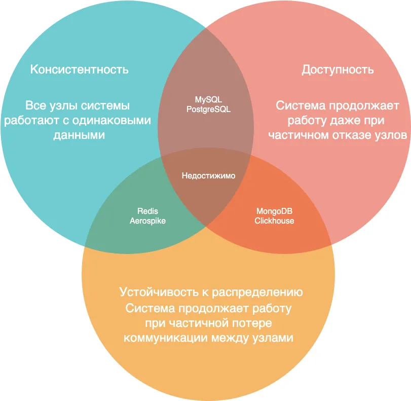

**возможно ли создать “идеальную” распределенную систему? CAP теорема дает нам ответ: НЕТ**

Согласно CAP теореме, распределенные системы имеют 3 основных состояния:

**C (Consistency) – консистентность**
Все узлы системы работают с одинаковым набором данных. Это означает, что пользователь системы может читать или записывать на любой узел и получит одни и те же данные.

**A (Availability) – доступность**
Любой запрос на рабочий узел будет обработан. Это означает, что даже в случае отказа одного и более узлов система должна продолжать обрабатывать запросы.

**P (Partition tolerance) – устойчивость к распределению**
В данном случае мы говорим о ситуации, когда рабочие узлы системы не могут общаться между собой из-за проблем с соединением. 
Устойчивая к распределению система должна продолжать работу даже в этом случае. 
Разумеется, кроме случая полного отказа сети. Данные должны быть реплицированы между наборами узлов и сетей для их работы в периоды проблем с соединением.

Описав основные составные части теоремы, перейдем непосредственно к ней. Теорема гласит:

В любой реализации распределённых вычислений возможно обеспечить не более двух из трёх следующих свойств

Т.е. мы можем создать систему, которая будет AP, CP или CA
На рисунке ниже мы можем увидеть возможные комбинации (с примерами реальных систем), наглядно:

