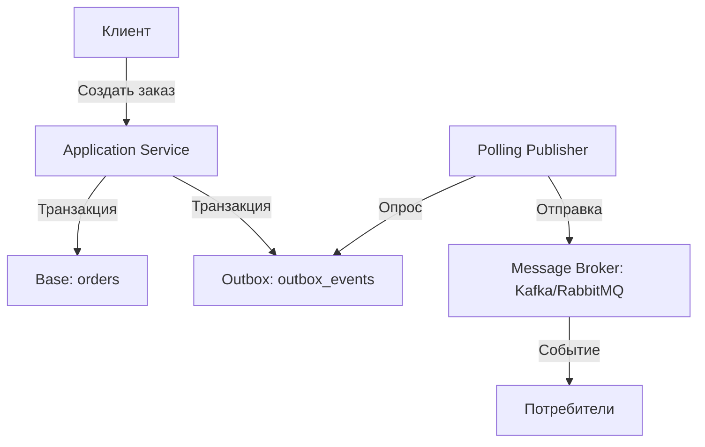

# Transactional Outbox Pattern – Надёжная передача событий между сервисами

> **Источник**: [proselyte.net/transactional-outbox/](https://proselyte.net/transactional-outbox/)  
> **Цель**: Изучение паттерна Transactional Outbox для гарантированной доставки событий в распределённых системах.

---

## 📌 Введение

**Transactional Outbox Pattern** — это архитектурный паттерн, который позволяет **гарантированно доставить события** между сервисами в распределённой системе, **избегая потери данных** и используя подход **at-least-once delivery** (доставка минимум один раз).

### 🔹 Зачем нужен Transactional Outbox?

В распределённых системах часто возникает проблема: **как обеспечить консистентность между базой данных и системой обмена сообщениями (например, Kafka, RabbitMQ)?**

- **Проблема**: Если сначала сохранить данные в БД, а потом отправить событие в очередь, то при сбое между этими операциями **событие может не быть отправлено**, и данные окажутся несинхронизированными.
- **Решение**: Transactional Outbox позволяет **сохранять данные и события в одной транзакции**, гарантируя, что если данные сохранены в БД, то событие будет отправлено.

---

## 🎯 Проблема, которую решает паттерн

### ❌ Традиционный подход (некорректный)

```java
// Проблема: если saveOrder() выполнится, но sendOrderEvent() упадёт, событие будет потеряно
@Transactional
public void createOrder(Order order) {
    orderRepository.save(order); // Сохранение в БД
    eventPublisher.publish(new OrderCreatedEvent(order)); // Отправка события
}
```

**Проблемы**:

- Если `eventPublisher.publish()` выбросит исключение, **транзакция откатится**, и заказ не будет сохранён.
- Если `eventPublisher.publish()` выполнится, но событие не дойдёт до брокера (например, из-за сетевой ошибки), **событие будет потеряно**.

### ✅ Решение с Transactional Outbox

Идея: **сохранять события в специальной таблице БД (Outbox) в той же транзакции**, что и основные данные. Затем **отдельный процесс** (Polling Publisher) читает события из Outbox и отправляет их в брокер.

---

## 🏗 Архитектура паттерна

### 📌 Основные компоненты

1. **Основная таблица БД** (например, `orders`):
  - Хранит бизнес-данные (заказы, пользователи и т. д.).
2. **Таблица Outbox** (например, `outbox_events`):
  - Хранит события, которые нужно отправить в брокер.
  - Содержит поля: `id`, `aggregate_type`, `aggregate_id`, `event_type`, `event_data`, `created_at`, `processed`.
3. **Приложение (Application Service)**:
  - Сохраняет данные в основную таблицу **и** событие в Outbox **в одной транзакции**.
4. **Polling Publisher (Опрашивающий издатель)**:
  - Периодически проверяет таблицу Outbox на наличие новых событий.
  - Отправляет события в брокер (Kafka, RabbitMQ).
  - Помечает события как обработанные (`processed = true`).
5. **Брокер сообщений (Message Broker)**:
  - Принимает события от Polling Publisher и доставляет их потребителям.

### 📊 Схема работы



---

## 🔄 Последовательность работы

1. **Клиент** отправляет запрос на создание заказа.
2. **Application Service**:
  - Начинает транзакцию.
  - Сохраняет заказ в таблицу `orders`.
  - Сохраняет событие `OrderCreatedEvent` в таблицу `outbox_events`.
  - Коммитит транзакцию.
3. **Polling Publisher** (работает в фоне):
  - Периодически опрашивает таблицу `outbox_events` на наличие новых событий (`processed = false`).
  - Для каждого нового события:
    - Отправляет его в брокер.
    - Помечает событие как обработанное (`processed = true`).
4. **Брокер** доставляет событие потребителям.

---

## 🗃 Реализация паттерна на Java

### 1. Создание таблицы Outbox

```sql
CREATE TABLE outbox_events (
    id BIGSERIAL PRIMARY KEY,
    aggregate_type VARCHAR(255) NOT NULL,  -- Тип сущности (например, "Order")
    aggregate_id VARCHAR(255) NOT NULL,   -- ID сущности (например, ID заказа)
    event_type VARCHAR(255) NOT NULL,      -- Тип события (например, "OrderCreated")
    event_data JSONB NOT NULL,             -- Данные события (в формате JSON)
    created_at TIMESTAMP DEFAULT NOW(),
    processed BOOLEAN DEFAULT FALSE        -- Флаг обработки
);

-- Индекс для ускорения выборки необработанных событий
CREATE INDEX idx_outbox_events_processed ON outbox_events(processed) WHERE processed = FALSE;
```

---

### 2. Модель события (Event)

```java
import java.time.Instant;
import java.util.UUID;

public class OutboxEvent {
    private Long id;
    private String aggregateType;  // Тип сущности (например, "Order")
    private String aggregateId;    // ID сущности (например, UUID заказа)
    private String eventType;      // Тип события (например, "OrderCreated")
    private String eventData;      // Данные события в JSON
    private Instant createdAt;
    private boolean processed;    // Обработано ли событие

    // Геттеры и сеттеры
}
```

---

### 3. Репозиторий для Outbox

```java
import org.springframework.data.jpa.repository.JpaRepository;
import org.springframework.stereotype.Repository;
import java.util.List;

@Repository
public interface OutboxEventRepository extends JpaRepository<OutboxEvent, Long> {
    // Найти все необработанные события
    List<OutboxEvent> findByProcessedFalse();
}
```

---

### 4. Сервис для сохранения заказа и события

```java
import org.springframework.stereotype.Service;
import org.springframework.transaction.annotation.Transactional;
import com.fasterxml.jackson.core.JsonProcessingException;
import com.fasterxml.jackson.databind.ObjectMapper;

@Service
public class OrderService {
    private final OrderRepository orderRepository;
    private final OutboxEventRepository outboxEventRepository;
    private final ObjectMapper objectMapper;

    public OrderService(OrderRepository orderRepository,
                        OutboxEventRepository outboxEventRepository,
                        ObjectMapper objectMapper) {
        this.orderRepository = orderRepository;
        this.outboxEventRepository = outboxEventRepository;
        this.objectMapper = objectMapper;
    }

    @Transactional
    public Order createOrder(Order order) throws JsonProcessingException {
        // Сохраняем заказ в основную таблицу
        Order savedOrder = orderRepository.save(order);

        // Создаём событие для Outbox
        OutboxEvent outboxEvent = new OutboxEvent();
        outboxEvent.setAggregateType("Order");
        outboxEvent.setAggregateId(savedOrder.getId().toString());
        outboxEvent.setEventType("OrderCreated");
        outboxEvent.setEventData(objectMapper.writeValueAsString(savedOrder));
        outboxEvent.setProcessed(false);

        // Сохраняем событие в Outbox (в той же транзакции)
        outboxEventRepository.save(outboxEvent);

        return savedOrder;
    }
}
```

---

### 5. Polling Publisher (Опрашивающий издатель)

```java
import org.springframework.scheduling.annotation.Scheduled;
import org.springframework.stereotype.Component;
import com.fasterxml.jackson.databind.ObjectMapper;

@Component
public class OutboxEventPublisher {
    private final OutboxEventRepository outboxEventRepository;
    private final EventPublisher eventPublisher; // Интерфейс для отправки событий в брокер
    private final ObjectMapper objectMapper;

    public OutboxEventPublisher(OutboxEventRepository outboxEventRepository,
                                EventPublisher eventPublisher,
                                ObjectMapper objectMapper) {
        this.outboxEventRepository = outboxEventRepository;
        this.eventPublisher = eventPublisher;
        this.objectMapper = objectMapper;
    }

    // Опрос таблицы Outbox каждые 5 секунд
    @Scheduled(fixedRate = 5000)
    public void publishEvents() {
        List<OutboxEvent> events = outboxEventRepository.findByProcessedFalse();
        
        for (OutboxEvent event : events) {
            try {
                // Отправляем событие в брокер
                eventPublisher.publish(event.getEventType(), event.getEventData());
                
                // Помечаем событие как обработанное
                event.setProcessed(true);
                outboxEventRepository.save(event);
            } catch (Exception e) {
                // Логируем ошибку и продолжаем обработку следующих событий
                System.err.println("Failed to publish event: " + event.getId() + ". Error: " + e.getMessage());
            }
        }
    }
}
```

---

### 6. Интерфейс EventPublisher (пример для Kafka)

```java
import org.springframework.kafka.core.KafkaTemplate;
import org.springframework.stereotype.Component;

@Component
public class KafkaEventPublisher implements EventPublisher {
    private final KafkaTemplate<String, String> kafkaTemplate;

    public KafkaEventPublisher(KafkaTemplate<String, String> kafkaTemplate) {
        this.kafkaTemplate = kafkaTemplate;
    }

    @Override
    public void publish(String eventType, String eventData) {
        kafkaTemplate.send("orders-topic", eventType, eventData);
    }
}
```

---

## ✅ Преимущества паттерна


| Преимущество                         | Описание                                                                     |
| ------------------------------------ | ---------------------------------------------------------------------------- |
| **Гарантированная доставка**         | События не теряются, так как сохраняются в БД вместе с бизнес-данными.       |
| **Консистентность**                  | Данные и события сохраняются в одной транзакции.                             |
| **Отказоустойчивость**               | Если брокер недоступен, события останутся в Outbox и будут отправлены позже. |
| **Простота реализации**              | Не требует распределённых транзакций (2PC, XA).                              |
| **Поддержка at-least-once delivery** | События доставляются минимум один раз (возможны дубликаты).                  |


---

## ❌ Недостатки и ограничения


| Недостаток            | Описание                                                 | Решение                                                                   |
| --------------------- | -------------------------------------------------------- | ------------------------------------------------------------------------- |
| **Задержка доставки** | События отправляются с задержкой (из-за опроса таблицы). | Уменьшить интервал опроса или использовать **CDC (Change Data Capture)**. |
| **Дубликаты событий** | Возможны дубликаты из-за at-least-once delivery.         | Сделать потребителей **идемпотентными** (устойчивыми к дублям).           |
| **Нагрузка на БД**    | Таблица Outbox может вырасти до больших размеров.        | Очищать обработанные события (например, раз в день).                      |
| **Сложность отладки** | Нужно отслеживать состояние Outbox.                      | Логировать обработку событий, мониторить размер таблицы.                  |


---

## 🔄 Альтернативные подходы

### 1. **Распределённые транзакции (2PC, XA)**

- **Описание**: Использование **двухфазного коммита** (2PC) для синхронизации БД и брокера.
- **Проблемы**:
  - Сложность реализации.
  - Низкая производительность.
  - Не все брокеры поддерживают XA-транзакции.

### 2. **Change Data Capture (CDC)**

- **Описание**: Использование инструментов вроде **Debezium** для отслеживания изменений в БД и автоматической отправки событий в брокер.
- **Плюсы**:
  - Нет задержки опроса.
  - Поддерживает реальное время.
- **Минусы**:
  - Сложность настройки.
  - Требует дополнительных ресурсов.

### 3. **Event Sourcing + CQRS**

- **Описание**: Хранение всех изменений как событий (Event Sourcing) и использование **CQRS** для разделения чтения и записи.
- **Плюсы**:
  - Полная история изменений.
  - Высокая масштабируемость.
- **Минусы**:
  - Сложность реализации.
  - Не подходит для всех задач.

---

## 💡 Советы по реализации

### 1. **Идемпотентность потребителей**

- Поскольку Transactional Outbox гарантирует **at-least-once delivery**, потребители должны быть **идемпотентными** (устойчивыми к дублям).
- **Пример**:
  - Для события `OrderCreated` проверяйте, существует ли уже заказ с таким ID, прежде чем создавать его заново.

### 2. **Очистка таблицы Outbox**

- Регулярно удаляйте обработанные события, чтобы таблица не росла бесконечно.
- **Пример**:
  ```java
  @Scheduled(cron = "0 0 0 * * ?") // Каждый день в 00:00
  public void cleanupOutbox() {
      outboxEventRepository.deleteByProcessedTrueAndCreatedAtBefore(
          Instant.now().minus(7, ChronoUnit.DAYS) // Удаляем события старше 7 дней
      );
  }
  ```

### 3. **Мониторинг**

- Отслеживайте:
  - Размер таблицы Outbox.
  - Количество необработанных событий.
  - Время между созданием события и его отправкой.
- **Пример метрик**:
  - `outbox_events_total` — общее количество событий.
  - `outbox_events_unprocessed` — количество необработанных событий.
  - `outbox_events_publish_latency` — задержка доставки.

### 4. **Транзакции и изоляция**

- Убедитесь, что **уровень изоляции** транзакции позволяет видеть изменения в таблице Outbox другим транзакциям (например, `READ_COMMITTED`).
- Избегайте **длинных транзакций**, чтобы не блокировать таблицу Outbox.

---

## 📌 Когда использовать Transactional Outbox?

### ✅ Подходящие сценарии

- **Микросервисная архитектура**: Когда нужно синхронизировать данные между сервисами.
- **Событийно-ориентированные системы**: Для надёжной доставки событий в брокер.
- **Отсутствие распределённых транзакций**: Когда нельзя использовать 2PC или XA.
- **Критичная консистентность**: Когда важно, чтобы данные и события были синхронизированы.

### ❌ Неподходящие сценарии

- **Высокая производительность**: Если нужна **реальная время** доставка событий, лучше использовать **CDC**.
- **Простые системы**: Если система небольшая и не требует надёжной доставки, можно обойтись без Outbox.
- **Брокеры с поддержкой XA**: Если брокер поддерживает XA-транзакции, можно использовать их.

---

## 🔗 Полезные ресурсы

- [Оригинальная статья на Proselyte](https://proselyte.net/transactional-outbox/)
- [Transactional Outbox Pattern (Eventuate)](https://eventuate.io/docs/manual/htmlsingle/#_the_transactional_outbox_pattern)
- [Debezium: Change Data Capture](https://debezium.io/)
- [Kafka Transactions](https://kafka.apache.org/documentation/#transactions)
- [Idempotent Consumer Pattern](https://www.enterpriseintegrationpatterns.com/patterns/messaging/IdempotentReceiver.html)

---

> **Вывод**: Transactional Outbox — это **простой и надёжный** способ гарантированной доставки событий в распределённых системах. Он подходит для большинства сценариев, где важна консистентность и отказоустойчивость. 🚀